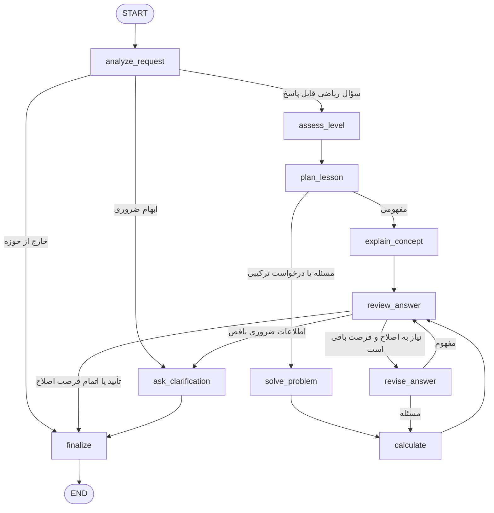

# معماری مرجع MATH_TUTOR

این طراحی، مرجع پیاده‌سازی تمرین چهارم است. نام هر نود دقیقاً با `agent.py` یکسان است و گراف واقعی نیز در `graph.mmd` استخراج شده است. می‌توان این طرح را برای بخش مدرس ریاضی تمرین سوم روی کاغذ رسم کرد؛ خروجی موردنیاز آن تمرین عکس طراحی روی کاغذ است.

برای اجرای برنامه، از داخل پوشهٔ پروژه `.\.venv\Scripts\python.exe cli.py` را بدون آرگومان بزنید. [DEMO.md](DEMO.md) ترتیب نمایش شاخه‌های گراف و State را در ترمینال VS Code مشخص می‌کند.

## اجزای اجرا و جریان داده

| فایل | مسئولیت |
|---|---|
| `agent.py` | State Schema، ده نود، Graph، شرط‌های تصمیم‌گیری و حافظهٔ `TutorSession` |
| `cli.py` | دریافت پیام و فرمان، اجرای هر نوبت و نمایش یا ذخیرهٔ نتیجه |
| `provider.py` | خواندن تنظیمات، ارتباط مدل و اعتبارسنجی پاسخ ساختاریافته |
| `math_tools.py` | محاسبهٔ مستقل و محدود برای عملیات پشتیبانی‌شده |
| `terminal.py` | رنگ و قالب‌بندی فقط در لایهٔ نمایش ترمینال |
| `report.py` | تولید گزارش HTML فقط‌خواندنی از State آخرین نوبت |

پیام از CLI وارد `TutorSession.send` می‌شود؛ جلسه، سابقه و درخواست معلق را به Graph می‌دهد. نودها بخش‌های State را به‌روز می‌کنند و `finalize` متن نهایی را می‌سازد. سپس CLI از همان نتیجه برای نمایش، ذخیرهٔ JSON یا گزارش اختیاری استفاده می‌کند. هیچ کد رنگی وارد State یا تاریخچه نمی‌شود و لایهٔ نمایش در انتخاب مسیر گراف دخالت ندارد. تعامل اصلی با کاربر در ترمینال انجام می‌شود.

## Graph

مسیر شفاف‌سازی در `END` متوقف می‌شود؛ CLI سؤال روشن‌کننده را نمایش می‌دهد و منتظر پیام بعدی می‌ماند. `TutorSession` درخواست معلق را حفظ می‌کند و پیام بعدی همراه آن و سابقه، وارد `analyze_request` می‌شود. هیچ نود گراف مستقیماً ورودی ترمینال نمی‌خواند.

## Nodeها

| نود | ورودی مهم | کار | فیلدهای به‌روز‌شده |
|---|---|---|---|
| `analyze_request` | درخواست، سؤال معلق، سابقه، زبان | تشخیص مفهوم/مسئله، موضوع، ابهام، سطح احتمالی و عملیات محاسباتی | `analysis`, `question` |
| `ask_clarification` | تحلیل یا بازبینی | تهیهٔ یک سؤال برای دادهٔ ضروری ناقص | `final_answer`, `status`, `verification` |
| `assess_level` | انتخاب کاربر و سطح تشخیص‌داده‌شده | اولویت دادن به سطح تعیین‌شده؛ در auto استفاده از تحلیل | `learner_level` |
| `plan_lesson` | سؤال و سطح | تعیین هدف، پیش‌نیاز، مثال/تشبیه و ترتیب آموزش | `plan` |
| `explain_concept` | طرح درس و سابقه | توضیح شهودی، مثال، رابطهٔ رسمی و پرسش یادگیری | `draft` |
| `solve_problem` | مسئله، طرح و سطح | حل مرحله‌به‌مرحله با دلیل هر مرحله و نتیجهٔ نهایی | `draft` |
| `calculate` | عملیات تحلیل‌شده و نتیجهٔ پیشنهادی | محاسبهٔ مستقل و تطبیق نتیجه در محدودهٔ ابزار | `tool_result` |
| `review_answer` | درخواست اصلی، طرح، پیش‌نویس، محاسبه | بررسی صحت، روشن بودن، زبان، سطح و تطابق با مسئلهٔ اصلی | `review` |
| `revise_answer` | اشکال‌های مشخص و محاسبه | تولید پاسخ اصلاح‌شده | `draft`, `revision_count` |
| `finalize` | وضعیت و پاسخ تأییدشده | قالب‌بندی پاسخ، سؤال روشن‌کننده یا پیام عدم تأیید | `final_answer`, `status`, `verification` |

نودها پس از پایان موفق خود، یک رخداد در `trace` ثبت می‌کنند: نام نود، فیلدهای تغییرکرده و زمان اجرا به میلی‌ثانیه. ثبت trace در wrapper مشترک انجام می‌شود. نودها بخشی از State را برمی‌گردانند و LangGraph آن را با State فعلی ادغام می‌کند. با `/trace on`، نام نود پیش از اجرای آن نیز در ترمینال دیده می‌شود؛ این پیام پیشرفت با رخداد تکمیل‌شدهٔ موجود در State تفاوت دارد.

## شرط‌ها و Branchها

1. **پس از تحلیل:** `out_of_scope → finalize`؛ نیاز به اطلاعات ضروری `→ ask_clarification`؛ در غیر این صورت `→ assess_level`.
2. **پس از برنامه‌ریزی:** `concept → explain_concept`؛ `problem → solve_problem`. درخواست هم‌زمان آموزش و محاسبه، در شاخهٔ مسئله قرار می‌گیرد.
3. **پس از بازبینی:** نیاز به اطلاعات کاربر `→ ask_clarification`؛ پاسخ پذیرفته‌شده `→ finalize`؛ پاسخ ردشده با `revision_count < max_revisions → revise_answer`؛ بعد از اتمام فرصت اصلاح `→ finalize` با وضعیت `unverified`.
4. **پس از اصلاح:** برای مسئله محاسبه و تطبیق دوباره انجام می‌شود؛ برای مفهوم مستقیماً بازبینی تکرار می‌شود.

`max_revisions` در سازندهٔ `MathTutorAgent` مقدار ۰، ۱ یا ۲ می‌پذیرد و پیش‌فرض آن ۱ است؛ CLI از همین پیش‌فرض استفاده می‌کند. `recursion_limit=24` مانع اجرای نامحدود گراف می‌شود. اگر نتیجهٔ پیشنهادی با ابزار ناسازگار باشد، برنامه تأیید مدل را نیز رد می‌کند. بدون عملیات قابل پشتیبانی، State صریحاً در دسترس نبودن ابزار را نشان می‌دهد.

## State Schema

تعریف دقیق در `TutorState` داخل `agent.py` است:

| فیلد | نوع | معنا |
|---|---|---|
| `raw_request` | `str` | متن اصلی پیام فعلی کاربر |
| `question` | `str` | سؤال فعلی پس از رفع ارجاع یا ترکیب با اطلاعات تکمیلی |
| `history` | `list[dict[str,str]]` | حداکثر ۱۲ پیام پیش از این اجرا |
| `level_choice` | `auto/beginner/intermediate/advanced` | ترجیح سطح کاربر |
| `previous_level` | `str` | سطح آخرین نوبت آموزشی برای تحلیل زمینه |
| `language` | `fa/en` | زبان انتخاب‌شده یا تشخیص‌داده‌شده |
| `analysis` | `RequestAnalysis` به شکل dict | نوع درخواست، موضوع، سؤال، سطح، ابهام و درخواست ابزار |
| `learner_level` | `beginner/intermediate/advanced` | سطح مؤثر برای همین نوبت |
| `plan` | `TeachingPlan` به شکل dict | هدف، پیش‌نیازها، تشبیه و ترتیب مراحل |
| `draft` | `TeachingAnswer` یا `ConceptAnswer` به شکل dict | مقدمه، مراحل، مثال، نتیجه و پرسش یادگیری |
| `tool_result` | `dict` | وضعیت ابزار، عبارت/کران‌ها، نتیجه و تطبیق با پاسخ مدل |
| `review` | `AnswerReview` به شکل dict | تأیید، ایرادها و نیاز به سؤال تکمیلی |
| `revision_count` | `int` | تعداد اصلاح‌های همین نوبت |
| `final_answer` | `str` | متنی که CLI نمایش می‌دهد |
| `status` | `running/answered/needs_clarification/out_of_scope/unverified` | نتیجهٔ اجرای فعلی |
| `verification` | `str` | نوع بررسی انجام‌شده یا علت عدم تأیید |
| `trace` | `Annotated[list[TraceEvent], operator.add]` | رخدادهای نودها که به یکدیگر اضافه می‌شوند |

`RequestAnalysis`، `TeachingPlan`، `TeachingAnswer`، `ConceptAnswer`، `AnswerReview` و `ToolRequest` با Pydantic اعتبارسنجی می‌شوند. `ConceptAnswer` مقدار `result` را به رشتهٔ خالی محدود می‌کند؛ محاسبه یا فرمولِ مثال مفهومی در مراحل و مثال قرار می‌گیرد. State گراف `TypedDict` است و برای trace یک reducer جمع‌کننده دارد؛ سایر فیلدها با خروجی نود بعدی جایگزین می‌شوند.

## State بین نوبت‌ها

`TutorSession` سابقه، `pending_request`، `previous_level`، سطح/زبان انتخاب‌شده و `last_state` را نگه می‌دارد. ابتدای هر پیام، `draft`، `review`، `tool_result`، شمارندهٔ اصلاح و trace از نو ساخته می‌شوند. بنابراین جواب یا مسیر سؤال قبلی وارد حل سؤال جدید نمی‌شود. سابقه به عنوان زمینهٔ گفت‌وگو منتقل می‌شود.

سابقه پس از پایان گراف بدون خطای اجرایی ثبت می‌شود؛ خطای شبکه یک نوبت ناقص را وارد حافظه نمی‌کند. پاسخ روشن‌کننده و خروجی با وضعیت `unverified` نیز نوبت‌های کامل‌شده‌اند. پاسخ روشن‌کننده درخواست معلق را برای پیام بعدی حفظ می‌کند. مقدار `history` در State، پیام‌های پیش از نوبت جاری است؛ پیام و پاسخ فعلی پس از پایان اجرا به حافظهٔ جلسه اضافه می‌شوند.

`/new` سابقه، درخواست معلق، سطح نوبت قبلی و `last_state` را پاک می‌کند؛ ترجیح سطح و زبان و فعال بودن نمایش trace حفظ می‌شوند. `/save` یک snapshot برای بررسی خروجی ذخیره می‌کند و هدف آن بازیابی خودکار گفت‌وگو نیست. `/html` نیز فقط گزارش آخرین State را می‌سازد.

## تصمیم‌های پیاده‌سازی

گراف صریح LangGraph شاخهٔ آموزش، حل، شفاف‌سازی و اصلاح را قابل مشاهده می‌کند. مدل برای تحلیل و آموزش استفاده می‌شود و محاسبات قابل پشتیبانی با ابزار مستقل مقایسه می‌شوند. موارد خارج از محدودهٔ ابزار، بازبینی مدل دارند و به عنوان بررسی مستقل معرفی نمی‌شوند.

اصلاح پاسخ به تعداد محدود انجام می‌شود؛ پس از اتمام فرصت، نتیجهٔ تأییدنشده با وضعیت `unverified` پایان می‌یابد. رنگ‌بندی و گزارش HTML از منطق Agent جدا هستند تا نمایش، ذخیرهٔ State و آزمون رفتار گراف مستقل باقی بمانند. محدودیت‌ها و معنای وضعیت‌های بررسی در [README](README.md#بررسی-پاسخ-و-مدیریت-خطا) آمده‌اند.

## مثال مسیرها

| ورودی | مسیر |
|---|---|
| «مشتق چیست؟» | تحلیل → سطح → طرح درس → توضیح → بازبینی → پایان |
| «مشتق x^3 + 2*x را حساب کن» | تحلیل → سطح → طرح درس → حل → محاسبه → بازبینی → پایان |
| «این معادله را حل کن» بدون سابقه | تحلیل → سؤال تکمیلی → پایان و انتظار CLI |
| پاسخ غلط قابل اصلاح | بازبینی → اصلاح → محاسبه برای مسئله → بازبینی → پایان |
| پاسخ همچنان غلط پس از اصلاح | بازبینی → پایان با `unverified` |
| سؤال خارج از حوزهٔ ریاضی | تحلیل → پایان با `out_of_scope` |

## ارتباط با معیارهای تمرین

| معیار | شاهد قابل بررسی |
|---|---|
| Graph و Nodeها — ۵۰ | `_build_graph`، شرط‌های مسیر، `graph.mmd`، `/trace on` و `/trace` |
| مدیریت State — ۵۰ | `TutorState`، reducer، `TutorSession`، `/state` و تست نوبت‌های متوالی |
| توضیح ساده — ۵۰ | تشخیص سطح، طرح آموزشی، مثال و پرسش یادگیری، نود بازبینی |
| CLI — ۵۰ | گفت‌وگوی بدون آرگومان، نمایش رنگی سؤال و جواب، فارسی/انگلیسی، فرمان‌ها و مدیریت خطا |
